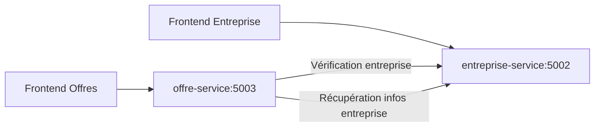

# TalentBridge - Architecture Microservices

## 🏗️ Architecture Globale

TalentBridge est maintenant architecturé en microservices avec une séparation claire des responsabilités :

### 📦 Services Indépendants

#### 1. **entreprise-service** (Port 5002)
- **Responsabilité**: Gestion des entreprises uniquement
- **Fonctionnalités**: CRUD entreprises
- **Base de données**: `entreprise_db.sqlite`
- **Frontend**: http://localhost:5173

#### 2. **offre-service** (Port 5003)
- **Responsabilité**: Gestion des offres et candidatures
- **Fonctionnalités**: CRUD offres, CRUD candidatures, filtres avancés
- **Base de données**: `offre_db.sqlite`
- **Frontend**: http://localhost:5174

### 🔄 Communication Inter-Services

Les services communiquent exclusivement via des APIs REST :



### 🌐 Points d'Accès

#### Entreprise Service
- **API**: http://localhost:5002/api/entreprises
- **Health**: http://localhost:5002/health
- **Frontend**: http://localhost:5173

#### Offre Service
- **API**: http://localhost:5003/api/offers
- **Health**: http://localhost:5003/health
- **Frontend**: http://localhost:5174

## 🚀 Démarrage Rapide

### Option 1: Démarrage Complet
```bash
# Depuis le dossier services/
start-all-services.bat
```

### Option 2: Démarrage Individuel
```bash
# Entreprise service
cd entreprise-service
start-sqlite.bat

# Offre service (dans un autre terminal)
cd offre-service
start-sqlite.bat
```

## 📚 Documentation API

### Entreprise Service API
```http
GET    /api/entreprises           # Lister les entreprises
GET    /api/entreprises/:id       # Détail entreprise
POST   /api/entreprises           # Créer entreprise
PUT    /api/entreprises/:id       # Modifier entreprise
DELETE /api/entreprises/:id       # Supprimer entreprise
```

### Offre Service API
```http
GET    /api/offers                 # Lister les offres (avec filtres)
GET    /api/offers?status=published&location=Paris  # Filtrer
POST   /api/offers                 # Créer offre
PUT    /api/offers/:id             # Modifier offre
DELETE /api/offers/:id             # Supprimer offre

POST   /api/offers/:id/applications                # Candidater
GET    /api/offers/:id/applications                # Lister candidatures
PATCH  /api/offers/applications/:id                # Mettre à jour statut

GET    /api/enterprises/:id          # Proxy vers entreprise-service
GET    /api/enterprises/:id/exists   # Vérifier existence entreprise
```

## 🔧 Fonctionnalités Avancées du Offre-Service

### 📊 Filtres Multicritères
- **Par statut**: `?status=published|closed|draft`
- **Par localisation**: `?location=Paris`
- **Par compétences**: `?skills=JavaScript,React`
- **Combinaison**: `?status=published&location=Paris&skills=React`

### 📝 Gestion des Candidatures
- **Postulation**: Formulaire avec lettre de motivation
- **Suivi**: Statuts (pending, accepted, rejected)
- **Gestion**: Acceptation/rejet par l'entreprise

### 🔗 Intégration Entreprise-Service
- **Vérification automatique**: L'offre vérifie l'existence de l'entreprise
- **Communication HTTP**: Appels API synchrones
- **Gestion d'erreur**: Messages clairs si entreprise introuvable

## 🗄️ Bases de Données Séparées

### Avantages
- **Isolation**: Chaque service a sa propre base de données
- **Scalabilité**: Indépendance de la scalabilité
- **Déploiement**: Mise à jour d'un service sans impacter l'autre
- **Sécurité**: Séparation des données sensibles

### Schémas

#### entreprise_db.sqlite
```sql
enterprises (
  id, ownerUserId, name, sector, description,
  addressLine1, city, postalCode, country, phone, website,
  created_at, updated_at
)
```

#### offre_db.sqlite
```sql
offers (
  id, enterpriseId, title, description, requiredSkills,
  location, status, publishedAt, created_at, updated_at
)

applications (
  id, offerId, studentUserId, coverLetter,
  status, created_at, updated_at
)
```

## 🧪 Tests

### Tests Individuels
```bash
# Tests entreprise-service
cd entreprise-service
npm test

# Tests offre-service
cd offre-service
npm test
```

### Tests Intégration
```bash
# Test communication inter-services
test-all-services.bat
```

## 🐳 Docker Support

Chaque service peut être containerisé indépendamment :
```bash
# entreprise-service
docker-compose up -d

# offre-service
cd offre-service
docker-compose up -d
```

## 🔄 CI/CD

Les pipelines sont indépendants pour chaque service :
- **entreprise-service**: `.github/workflows/ci-cd.yml`
- **offre-service**: `.github/workflows/ci-cd.yml`

## 📈 Monitoring

Chaque service expose son propre endpoint de santé :
- `/health` avec nom du service et timestamp
- Monitoring indépendant possible
- Alertes spécifiques par service

## 🚨 Gestion des Erreurs

### Communication Inter-Services
- **Timeout**: 5 secondes pour les appels API
- **Retry**: 3 tentatives maximum
- **Fallback**: Messages d'erreur explicites

### Erreurs Communes
- **ECONNREFUSED**: Service non démarré
- **404**: Entreprise introuvable
- **400**: Données invalides

## 🎯 Bonnes Pratiques

### Architecture
- **Bounded Context**: Chaque service a un contexte métier clair
- **Loose Coupling**: Communication minimale entre services
- **High Cohesion**: Fonctionnalités regroupées logiquement

### Développement
- **Independent Deployment**: Services déploiables indépendamment
- **Data Ownership**: Chaque service possède ses données
- **API First**: APIs bien définies et versionnées

---

**TalentBridge Microservices**  
*Architecture scalable et maintenable*
