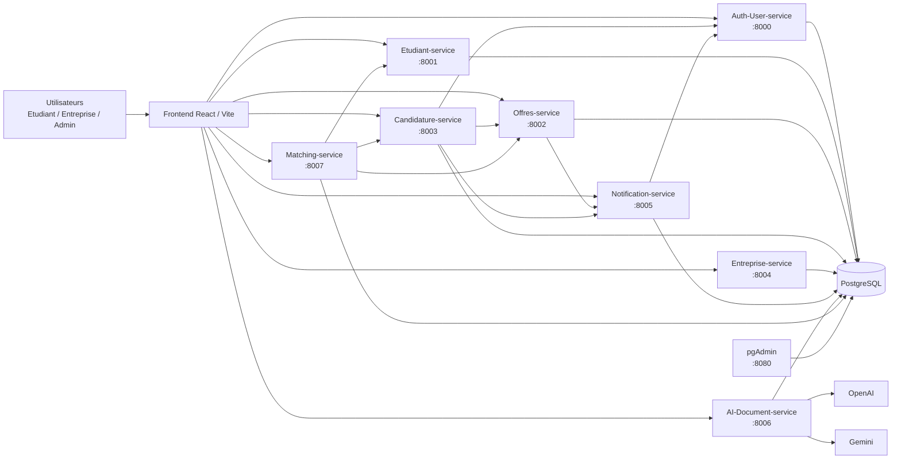
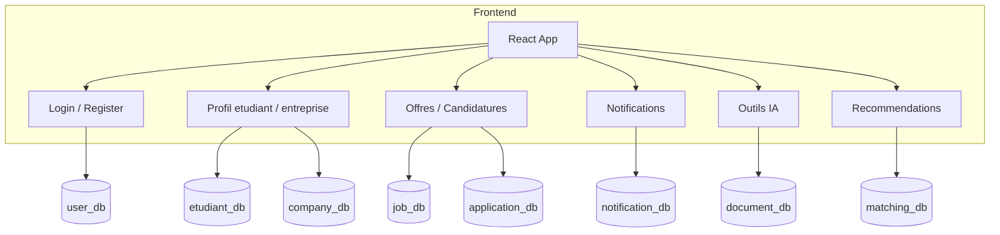
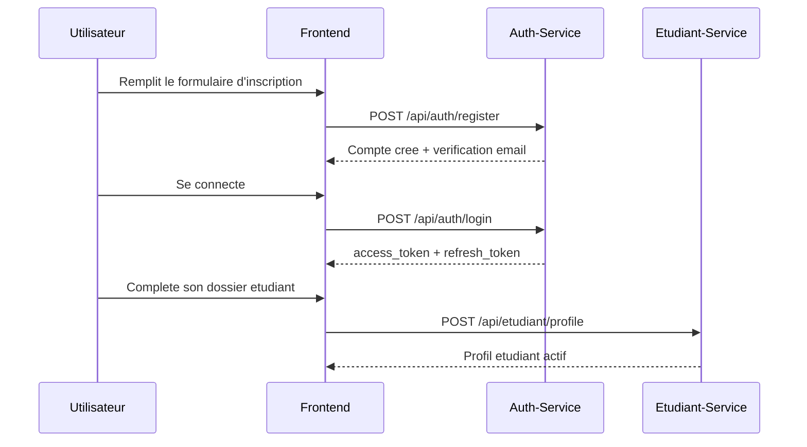
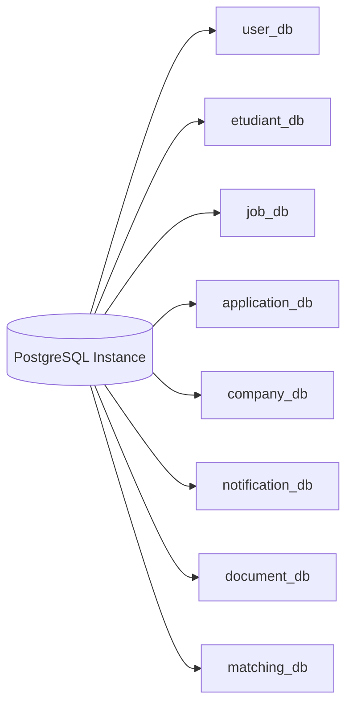

<p align="center">
  
</p>

# TalentBridge Cloud-Native Microservices Platform

TalentBridge est une plateforme SaaS cloud-native qui connecte les etudiants, les entreprises et les administrateurs via une architecture microservices. Le projet couvre l'authentification, la gestion des profils, la publication d'offres, les candidatures, les notifications, la recommandation intelligente et la generation assistee par IA de documents professionnels.

L'objectif de la plateforme est simple :

- permettre a un etudiant de creer son profil, chercher des opportunites, postuler et recevoir des recommandations pertinentes ;
- permettre a une entreprise de configurer sa fiche, publier des offres, suivre les candidatures et communiquer avec les talents ;
- fournir une architecture modulaire, scalable et maintenable, adaptee a une approche DevOps, Docker et microservices.

---

## 1. Vision du projet

TalentBridge a ete pense comme une plateforme moderne basee sur :

- un frontend React/Vite pour l'experience utilisateur ;
- plusieurs microservices isoles, chacun responsable d'un domaine metier ;
- une instance PostgreSQL centralisee avec une base logique dediee par service ;
- une communication inter-services maitrisee via HTTP REST, JWT et tokens internes ;
- une execution locale simple via Docker Compose.

Les principaux domaines fonctionnels sont :

- authentification et gestion des utilisateurs ;
- gestion des profils etudiants ;
- gestion des profils entreprises ;
- publication et consultation des offres ;
- gestion des candidatures ;
- notifications email et in-app ;
- generation de CV, lettres et emails via IA ;
- matching etudiant/offre et entreprise/candidats.

---

## 2. Vue d'ensemble de l'architecture



---

## 3. Relation entre frontend, services et base de donnees



Cette separation permet :

- d'isoler la logique metier de chaque service ;
- de limiter l'impact d'une panne a un domaine specifique ;
- de simplifier les evolutions et les tests ;
- d'eviter un backend monolithique difficile a maintenir.

---

## 4. Structure globale du repository

```text
TalentBridge-Cloud-Native-Microservices-Platform/
+-- README.md
+-- .gitattributes
+-- .github/
|   +-- workflows/
|       +-- ci.yml
+-- Dev/
|   +-- docker-compose.yaml
|   +-- Frontend/
|   +-- Microservices/
|       +-- Auth-User-service/
|       +-- Etudiant-service/
|       +-- Offres-service/
|       +-- Candidature-service/
|       +-- Entreprise-service/
|       +-- Notification-service/
|       +-- AI-Document-service/
|       +-- Matching-service/
|       +-- Gateway-service/  (present dans le repo, non active dans le compose actuel)
+-- logo de platforme/
    +-- logo.png
```

---

## 5. Composants techniques du projet

| Composant | Technologie principale | Role |
|---|---|---|
| Frontend | React 19, Vite, React Router | Interface utilisateur SaaS |
| Auth-User-service | FastAPI, SQLAlchemy, PostgreSQL | Authentification, utilisateurs, roles, JWT |
| Services metier Node.js | Express, Sequelize, PostgreSQL | Profils, offres, candidatures, notifications, IA, matching |
| Base de donnees | PostgreSQL 15 | Persistance multi-bases logiques |
| Administration BD | pgAdmin | Visualisation et administration des donnees |
| Orchestration locale | Docker Compose | Lancement local de toute la plateforme |
| IA | OpenAI + Gemini | Generation documentaire et fallback IA |

---

## 6. Tableau detaille de tous les services

| Service | Port | Base logique | Role principal | Ce qu'il fait concretement | Dependances principales |
|---|---:|---|---|---|---|
| Frontend | 5173 | Aucune | Interface utilisateur | Auth, profil, offres, candidatures, notifications, IA, recommandations | Tous les services backend |
| Auth-User-service | 8000 | `user_db` | Authentification et gestion des utilisateurs | Register, login, refresh, logout, verification email, reset password, profil utilisateur, administration | PostgreSQL |
| Etudiant-service | 8001 | `etudiant_db` | Gestion du dossier etudiant | Profil etudiant, formations, experiences, competences, langues, CV | PostgreSQL, JWT Auth |
| Offres-service | 8002 | `job_db` | Gestion des offres | Creation, recherche, detail, edition, suppression, comptage des candidatures | PostgreSQL, Notification-service |
| Candidature-service | 8003 | `application_db` | Gestion des candidatures | Postuler, lister mes candidatures, lister les candidatures d'une offre, changer le statut | PostgreSQL, Offres-service, Notification-service, Auth-User-service |
| Entreprise-service | 8004 | `company_db` | Gestion du profil entreprise | Fiche entreprise, informations publiques, mise a jour du compte entreprise | PostgreSQL, JWT Auth |
| Notification-service | 8005 | `notification_db` | Notifications in-app et email | Cloche frontend, marquage lu, mails lors de nouvelle offre, nouvelle candidature, changement statut | PostgreSQL, Auth-User-service, SMTP |
| AI-Document-service | 8006 | `document_db` | Generation de documents par IA | CV, lettre de motivation, email professionnel, adaptation d'offre, stockage des documents generes | PostgreSQL, OpenAI, Gemini |
| Matching-service | 8007 | `matching_db` | Recommandation intelligente | Score de compatibilite entre etudiants et offres, top recommandations | PostgreSQL, Etudiant-service, Offres-service, Candidature-service |
| Gateway-service | Non expose dans le compose actuel | Non documentee ici | Reserve / extension future | Service present dans le repo mais pas branche dans la stack active | A clarifier selon evolution |
| PostgreSQL | 5432 | Plusieurs bases | Persistance | Heberge les bases `user_db`, `etudiant_db`, `job_db`, `application_db`, `company_db`, `notification_db`, `document_db`, `matching_db` | Volume Docker |
| pgAdmin | 8080 | Aucune | Administration de la BD | Interface d'administration PostgreSQL | PostgreSQL |

---

## 7. Role detaille de chaque microservice

### 7.1 Auth-User-service

C'est le coeur de la securite de la plateforme.

Responsabilites :

- creer les comptes ;
- connecter les utilisateurs ;
- emettre les JWT access et refresh ;
- gerer les roles `admin`, `etudiant`, `entreprise` ;
- gerer la verification email ;
- gerer le mot de passe oublie et la reinitialisation ;
- exposer le profil utilisateur global.

Routes majeures :

- `POST /api/auth/register`
- `POST /api/auth/login`
- `POST /api/auth/refresh`
- `POST /api/auth/logout`
- `GET /api/utilisateurs/profile`
- `PUT /api/utilisateurs/profile`

### 7.2 Etudiant-service

Ce service gere tout le dossier metier de l'etudiant, separe de l'authentification.

Responsabilites :

- creation du profil etudiant ;
- mise a jour du niveau, universite, localisation, CV ;
- gestion des formations ;
- gestion des experiences ;
- gestion des competences ;
- gestion des langues ;
- alimentation des donnees utilisees par le matching.

Routes majeures :

- `POST /api/etudiant/profile`
- `GET /api/etudiant/me`
- `PUT /api/etudiant/me`
- `GET/POST /api/etudiant/experience`
- `GET/POST /api/etudiant/formation`
- `GET/POST /api/etudiant/competence`
- `GET/POST /api/etudiant/langue`

### 7.3 Offres-service

Il gere le cycle de vie des offres publiees par les entreprises.

Responsabilites :

- creer une offre ;
- modifier une offre ;
- supprimer une offre ;
- lister les offres ;
- rechercher des offres avec filtres ;
- exposer le detail d'une offre ;
- incrementer le compteur de candidatures ;
- notifier les etudiants lors d'une nouvelle publication.

### 7.4 Candidature-service

Il gere la relation entre etudiants et offres.

Responsabilites :

- depot d'une candidature ;
- verification de l'existence et de l'etat de l'offre ;
- prevention des doublons ;
- listing des candidatures de l'etudiant ;
- listing des candidatures d'une offre cote entreprise ;
- mise a jour du statut (`en_attente`, `accepte`, `refuse`) ;
- emission de notifications.

### 7.5 Entreprise-service

Il stocke et expose la fiche metier d'une entreprise.

Responsabilites :

- creation de la fiche entreprise apres inscription ;
- mise a jour du nom, secteur, description, adresse, ville, pays, logo, site web ;
- alimentation des pages profil et des offres publiees.

### 7.6 Notification-service

Il centralise les communications utilisateurs.

Responsabilites :

- cloche de notifications frontend ;
- stockage des notifications in-app ;
- marquage des notifications comme lues ;
- envoi d'emails transactionnels ;
- notifications de publication d'offre ;
- notifications de nouvelle candidature ;
- notifications de changement de statut.

### 7.7 AI-Document-service

Il apporte la couche IA de TalentBridge.

Responsabilites :

- generation de CV ;
- generation de lettre de motivation ;
- generation d'email professionnel ;
- adaptation d'un texte a une offre ;
- stockage et suppression des documents generes ;
- fallback entre plusieurs providers IA.

### 7.8 Matching-service

Il calcule la pertinence entre profils et opportunites.

Responsabilites :

- calcul du score de compatibilite etudiant -> offres ;
- calcul du score entreprise -> candidats pour une offre ;
- exploitation des competences, de la localisation et de l'experience ;
- classement des meilleurs resultats.

---

## 8. Frontend : ce qu'il consomme et ce qu'il affiche

Le frontend `Dev/Frontend` consomme tous les services principaux et structure l'experience autour de pages metier.

### Pages et modules principaux

| Module frontend | Role |
|---|---|
| Login / Register | Connexion et inscription |
| Email verification / Reset password | Activation et recuperation de compte |
| Student Setup | Creation du dossier etudiant |
| Enterprise Setup | Configuration initiale d'une entreprise |
| Offres | Catalogue, filtres, consultation detaillee |
| Candidatures | Suivi des candidatures envoyees |
| Notifications | Lecture des notifications in-app |
| AI Tools | Generation assistee de documents |
| Profil | Gestion des informations utilisateur et metier |
| Recommendations | Suggestions d'offres selon le matching |

### Services frontend relies au backend

| Frontend -> Service | Usage |
|---|---|
| React -> Auth-User-service | session, profile, administration |
| React -> Etudiant-service | profil etudiant et blocs du dossier |
| React -> Entreprise-service | fiche entreprise |
| React -> Offres-service | catalogue, detail, edition |
| React -> Candidature-service | postuler et suivre les statuts |
| React -> Notification-service | cloche et centre de notifications |
| React -> AI-Document-service | formulaires IA et documents generes |
| React -> Matching-service | recommandations intelligentes |

---

## 9. Flux fonctionnels principaux

### 9.1 Flux d'inscription etudiant



### 9.2 Flux publication d'offre

```mermaid
sequenceDiagram
    participant E as Entreprise
    participant FE as Frontend
    participant OFF as Offres-Service
    participant NOTIF as Notification-Service
    participant AUTH as Auth-Service

    E->>FE: Cree une offre
    FE->>OFF: POST /api/offres
    OFF-->>FE: Offre creee
    OFF->>NOTIF: POST /api/notifications/new-offre
    NOTIF->>AUTH: Recuperation des etudiants cibles
    NOTIF-->>E: Notification traitee
```

### 9.3 Flux candidature et suivi

```mermaid
sequenceDiagram
    participant S as Etudiant
    participant FE as Frontend
    participant CAD as Candidature-Service
    participant OFF as Offres-Service
    participant NOTIF as Notification-Service

    S->>FE: Clique sur postuler
    FE->>CAD: POST /api/candidatures
    CAD->>OFF: Verifie l'offre
    CAD->>OFF: Incremente le nombre de candidatures
    CAD->>NOTIF: Nouvelle candidature
    CAD-->>FE: Candidature enregistree
```

---

## 10. Bases de donnees logiques

Bien que la stack utilise une seule instance PostgreSQL, chaque service travaille avec sa propre base logique.

| Base logique | Service proprietaire | Contenu principal |
|---|---|---|
| `user_db` | Auth-User-service | utilisateurs, sessions, tokens, verification email |
| `etudiant_db` | Etudiant-service | profil etudiant, experiences, formations, competences, langues |
| `job_db` | Offres-service | offres d'emploi et de stage |
| `application_db` | Candidature-service | candidatures et statuts |
| `company_db` | Entreprise-service | profils entreprises |
| `notification_db` | Notification-service | notifications in-app et traces metier |
| `document_db` | AI-Document-service | documents generes par IA |
| `matching_db` | Matching-service | scores et historiques de matching |



---

## 11. Ports utilises dans la stack Docker

| Service | URL locale |
|---|---|
| Frontend | `http://localhost:5173` |
| Auth-User-service | `http://localhost:8000` |
| Etudiant-service | `http://localhost:8001` |
| Offres-service | `http://localhost:8002` |
| Candidature-service | `http://localhost:8003` |
| Entreprise-service | `http://localhost:8004` |
| Notification-service | `http://localhost:8005` |
| AI-Document-service | `http://localhost:8006` |
| Matching-service | `http://localhost:8007` |
| pgAdmin | `http://localhost:8080` |
| PostgreSQL | `localhost:5432` |

---

## 12. Lancement du projet

### 12.1 Avec Docker Compose

Depuis le dossier `Dev` :

```bash
docker compose up -d --build
```

Pour rebuild un seul service :

```bash
docker compose up -d --build frontend
docker compose up -d --build auth-user-service
```

### 12.2 Lancement service par service

Chaque microservice possede son propre README interne dans `Dev/Microservices/...` avec les details de demarrage, variables d'environnement et tests.

Exemples :

- `Dev/Microservices/Auth-User-service/README.md`
- `Dev/Microservices/Etudiant-service/README.md`
- `Dev/Microservices/Candidature-service/README.md`
- `Dev/Microservices/Notification-service/README.md`
- `Dev/Microservices/AI-Document-service/README.md`
- `Dev/Microservices/Matching-service/README.md`

### 12.3 Frontend en local

```bash
cd Dev/Frontend
npm install
npm run dev -- --host 0.0.0.0 --port 5173
```

---

## 13. Variables d'environnement

Le projet depend fortement des fichiers `.env`.

Bonnes pratiques :

- ne jamais committer les vraies cles API ;
- utiliser des `.env.example` lorsqu'ils existent ;
- aligner les secrets JWT entre les services qui valident les memes tokens ;
- aligner les tokens internes entre services qui communiquent entre eux ;
- verifier les URLs inter-services dans `Dev/docker-compose.yaml`.

Variables importantes selon les domaines :

- `JWT_SECRET`, `SECRET_KEY`, `ALGORITHM`, `HS256` pour l'authentification ;
- `DATABASE_URL` pour chaque service ;
- `NOTIFICATION_INTERNAL_TOKEN` pour les appels internes notification ;
- `MATCHING_SERVICE_TOKEN` pour les appels internes de matching ;
- `OPENAI_API_KEY`, `OPENAI_MODEL`, `GEMINI_API_KEY`, `GEMINI_MODEL` pour l'IA ;
- `SMTP_*` pour l'envoi d'emails.

---

## 14. Securite et communication inter-services

La plateforme utilise plusieurs niveaux de securite :

- JWT pour authentifier les utilisateurs ;
- verification du role utilisateur selon les routes ;
- tokens internes pour autoriser certains appels machine-a-machine ;
- separation des responsabilites entre service Auth et services metier ;
- messages d'erreurs cotes backend au format simple `{ "message": "..." }`.

Quelques dependances critiques :

- les services metier qui verifient les JWT doivent partager le meme secret et le meme algorithme que le service Auth ;
- `Notification-service` depend du service Auth pour certains enrichissements utilisateurs ;
- `Candidature-service` depend du service Offres pour verifier une offre avant candidature ;
- `Matching-service` depend de plusieurs services pour construire un score fiable.

---

## 15. Cas d'usage couverts par TalentBridge

### Cote etudiant

- creer un compte ;
- verifier son email ;
- completer son profil ;
- ajouter ses experiences, formations, competences et langues ;
- consulter les offres de stage et d'emploi ;
- postuler ;
- suivre ses candidatures ;
- generer un CV, une lettre et un email professionnel ;
- recevoir des recommandations intelligentes.

### Cote entreprise

- creer un compte ;
- completer la fiche entreprise ;
- publier des offres ;
- consulter les candidatures recues ;
- changer le statut d'une candidature ;
- generer ou adapter des contenus via IA ;
- recevoir des notifications liees a l'activite de recrutement.

### Cote admin

- gerer les utilisateurs ;
- suivre les comptes supprimes logiquement ;
- restaurer des utilisateurs ;
- superviser l'activite globale.

---

## 16. Points forts de l'architecture

- decoupage metier clair ;
- extensibilite facile par ajout de nouveaux services ;
- isolation des bases logiques ;
- frontend moderne et branchable a chaque domaine ;
- approche adaptee a Docker, CI/CD et cloud-native ;
- support des communications synchrones et des traitements inter-services.

---

## 17. Limites actuelles et pistes d'evolution

- le `Gateway-service` est present dans le repository mais pas encore integre dans la stack active du `docker-compose` ;
- certaines integrations peuvent encore etre davantage mutualisees via une couche gateway/API management ;
- la securisation des secrets doit etre externalisee en environnement de production ;
- l'observabilite peut etre enrichie avec tracing, metrics et logs centralises ;
- le deploiement Kubernetes peut constituer l'etape naturelle suivante.

---

## 18. Resume rapide

TalentBridge est une plateforme SaaS microservices complete qui relie :

- un frontend React moderne ;
- huit domaines metier principaux ;
- une persistance PostgreSQL separee par base logique ;
- une couche de notifications ;
- une couche IA ;
- une couche de matching intelligent.

Le projet sert a la fois de plateforme metier de recrutement et de cas pratique solide pour :

- architecture microservices ;
- Docker Compose ;
- gestion des environnements ;
- separation frontend/backend ;
- securite JWT ;
- orchestration inter-services ;
- documentation et onboarding technique.
